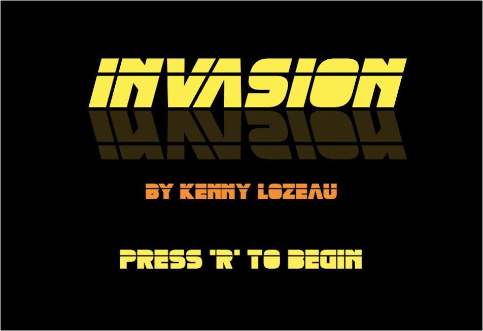
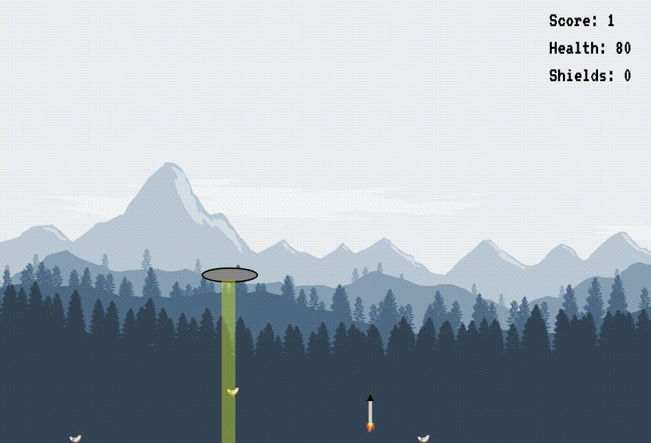

# Overview
[Invasion! Live Site](https://kennylozeau.github.io/Invasion)

**_Invasion!_** is an original arcade-style game in which the player controls a flying-saucer from outer space. The player's mission is to collect objects from Earth, while of course avoiding the constant attacks from frightened Earthlings.

# Technologies Used
  * JavaScript
  * HTML 5 Canvas

# Gameplay
  * Players control the flying-saucer using the four arrow keys
  * Holding the shift key activates hyperdrive, doubling the speed of the flying-saucer
  * The tractor beam is activated by holding the spacebar
  * Shields, when available, are activated by pressing the 'x' key and protect against a single missile strike for up to 8 seconds
  * Collecting an object earns the player one point
  * Collecting a crate also earns the player one shield
    * Crates appear every time the player earns 10 points
  * Any object that is dropped and caught before reaching the ground will earn the player two points
  * Missile velocity increases every time the player earns 15 points
  * Players rapidly lose health while in contact with the ground

# Significant Features

### Custom-designed collision detection
  * Capable of changing behavior depending on gameplay
  * Allows the player to interact with objects in complex ways, such as throwing and catching

### Real-time high scores
  * Accomplished by utilizing Google Firebase (Cloud Firestore)

# Future Features
  * Additional enemies to avoid, such as side-spawning fighter jets
  * Additional "tricks" implemented for retrieving objects, such as catching an object from below it or "looping and catching"
  * Multi-player functionality