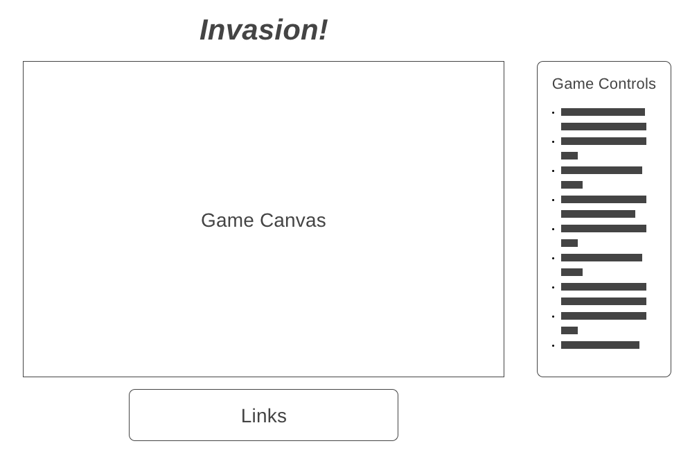

# Overview
**_Invasion!_** is a game in which the player controls a flying-saucer from outer space. The player's mission is to collect objects from Earth, while of course avoiding the constant attacks from frightened Earthlings.

# Functionality and MVPs
Players will control a flying-saucer with the mission of beaming up objects from Earth. While using the tractor beam, the fly-saucer will need to remain stationary. Meanwhile, Earth will be launching missile at the flying-saucer, which must be avoided by the player.

## Main MVPs
  * Player-controller flying-saucer that can beam-up objects from the ground
  * Players will have scores based on the number of objects collected and a health meter based on number of missile impacts
  * Missiles will be launched from Earth towards the flying-saucer
  * Target objects and missile launchers will be randomly placed

## Bonus MVPs
  * New levels reached after collecting a certain number of objects
  * Ability to activate a temporary shield
  * Fighter jets!
  * High scores

# Wireframes

**_Invasion!_** will consist of a single game canvas, primarily, below a header for the game. Adjacent to the gameplay area will be a list of game controls and helpful instructions. Links to social media will remain below the game, allowing it to remain the main focus.

# Architecture and Technology

**_Invasion!_** will be implemented with the following technologies:
  * JavaScript for the main game logic
  * HTML Canvas for rendering the game
  * Webpack to bundle the files

# Implementation Timeline

### Day 1
  * Ensure adequate basic setup
  * Spend time learning various aspects of Canvas

### Day 2
  * Build basic functionality for flying-saucer to move and beam-up objects
  * Have the functionality to randomly place new objects at certain intervals
  * Add score functionality

### Day 3
  * Implement missile functionality and collision detection
  * Write logic for health meter

### Day 4
  * Work on styling
  * Add bonus features